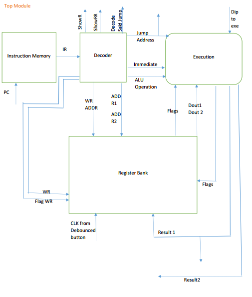

# DharmaChakra
 A Central Processing Unit described in Verilog. Synthesized for Xilinx Spartan6 - XC6SLX9.
 
 I used Xilinx ISE project navigator version: 14.7
 
 //*****************************************************************************************************************************
 
 If you dont use ISE tools or you dont even know where to start, try these:
 
 1- First take a look at simplified block diagram of the project which illustrates a kind of structural view of the project.
 
 2- Copy all .v files into your project and to compile it.
 
 
 //*****************************************************************************************************************************
 
 
 You can approximately use any Hardware Description Environment to do further works on this project.
 
 A list of instructions this processor can do is available as: [List of Instructions -- Version 1.01](https://github.com/amdeilami/DharmaChakra/blob/main/List%20of%20Instructions%20--%20Version%201.01.pdf).
 
 
 //*****************************************************************************************************************************
 
 
 
 
 
 
